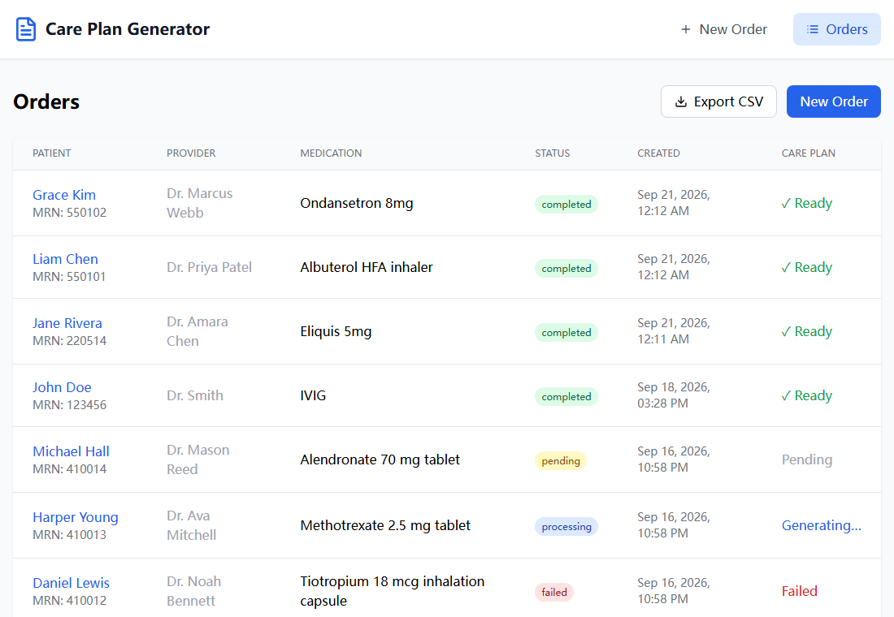
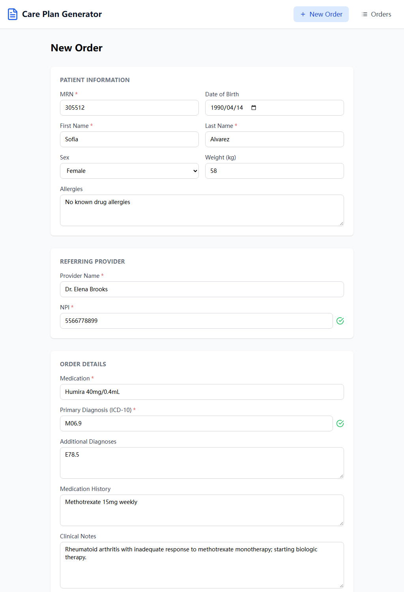
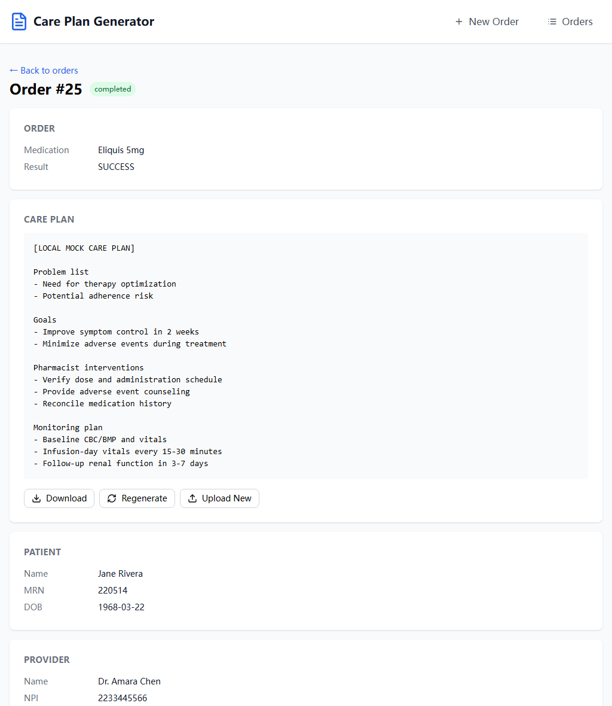

# Care Plan Generator

A full-stack web application for specialty pharmacies to automatically generate care plans using LLM technology.

## Background

**Customer:** A specialty pharmacy

**Problem:** Pharmacists spend 20-40 minutes per patient manually creating care plans. These are required for compliance and Medicare/pharma reimbursement. The pharmacy is short-staffed and backlogged.

**Solution:** A web application that allows medical assistants to input patient/order information and automatically generate care plans using an LLM.

This implementation is built as a guided, day-by-day learning project: a Java/Spring Boot + React port of a Python/Django reference implementation, built up from a synchronous MVP to an async, queue-backed, monitored, cloud-deployable app. See [Current Status](#current-status) for what stage it's at.

## Screenshots

**Orders list** — patients, providers, medications, and care plan status at a glance, including every state (`completed`, `pending`, `processing`, `failed`):



**New order form** — patient, provider, and order details in one submission:



**Order detail** — the generated care plan alongside patient/provider info and download/regenerate/upload actions:



## Current Status

Implemented pieces:

- React frontend for creating orders and viewing care plan generation status
- Spring Boot REST API
- PostgreSQL persistence for `Patient`, `Provider`, `Order`, and `CarePlan`
- Redis-backed queue for care plan generation jobs
- Scheduled worker that consumes queued jobs and calls an LLM provider
- Polling API for checking care plan generation status
- Request validation, duplicate detection, warning handling, and unified error responses
- Adapter Pattern for ingesting orders from different external sources
- CSV export/reporting endpoints
- Standalone Patient/Provider CRUD APIs
- Unit and integration tests
- Prometheus and Grafana local monitoring setup (backend-only compose file)
- AWS Lambda / SQS handler and packaging practice code, plus Terraform practice stacks

## Features

- ✅ Web form for patient/provider/order data entry
- ✅ Real-time input validation (NPI, MRN, ICD-10, etc.)
- ✅ Duplicate detection for patients, providers, and orders
- ✅ LLM-powered care plan generation
- ✅ Async processing with Redis + a scheduled worker
- ✅ Care plan download, regenerate, and manual upload
- ✅ Export all order/care plan data to CSV

## Tech Stack

| Component | Technology |
|-----------|------------|
| Backend | Spring Boot 4.0, Spring Web MVC, Spring Data JPA |
| Database | PostgreSQL 15 |
| Task Queue | Redis 7 + Spring `@Scheduled` worker (`CarePlanWorker`) |
| LLM | OpenAI / Anthropic Claude / local mock (configurable) |
| Frontend | React 18 + TypeScript, Vite, React Router, TanStack Query, React Hook Form + Zod, Tailwind CSS |
| Infrastructure | Docker, Docker Compose, Terraform (AWS practice stacks) |

## Quick Start

### Prerequisites

- Docker & Docker Compose

### Setup

```bash
# 1. Clone repository
git clone <repo-url>
cd CarePlanGenerator

# 2. Copy environment file and configure API keys
cp backend/.env.example backend/.env
# Edit backend/.env with your LLM_API_KEY (OpenAI) or CLAUDE_API_KEY
# Not required for local development: LLM_MOCK_ENABLED=true is the default,
# so the app runs end-to-end with a local mock LLM out of the box.

# 3. Start all services (postgres, redis, backend, frontend)
docker compose up --build
```

All services will be running via Docker. On first startup, the backend inserts mock data automatically (skipped if the database already has data — there is no separate seed command to run).

### Access the App

| Service | URL |
|---------|-----|
| Frontend | http://localhost:3000 |
| API | http://localhost:8080/api/v1/ |
| Actuator health | http://localhost:8080/actuator/health |

## Input Fields

Field names are camelCase, matching `CreateOrderRequest`.

### Patient Information

| Field | Type | Validation |
|-------|------|------------|
| patientFirstName | string | Required |
| patientLastName | string | Required |
| patientMrn | string | Required, exactly 6 digits |
| patientDateOfBirth | date | Optional |
| patientSex | string | Optional |
| patientWeightKg | number | Optional; if given, > 0 and ≤ 500 |
| patientAllergies | string | Optional |

### Provider Information

| Field | Type | Validation |
|-------|------|------------|
| providerName | string | Required |
| providerNpi | string | Required, exactly 10 digits |

### Order Information

| Field | Type | Validation |
|-------|------|------------|
| medicationName | string | Required |
| primaryDiagnosis | string | Required, ICD-10 format (e.g., G70.00) |
| additionalDiagnoses | list of strings | Optional; each entry must be ICD-10 format |
| medicationHistory | list of strings | Optional; each entry up to 500 characters |
| patientRecords | string | Optional free text (clinical notes) |

## Duplicate Detection Logic

### Patient Duplicates

| Scenario | Condition | Result |
|----------|-----------|--------|
| Exact match | MRN matches an existing patient, and name + date of birth also match (or no DOB was submitted) | ✅ Reuse existing patient |
| MRN conflict | MRN matches an existing patient, but name or date of birth differs | ⚠️ WARNING (must resubmit with `confirm=true`) |
| Possible duplicate | MRN is new, but name + date of birth match an existing patient | ⚠️ WARNING (must resubmit with `confirm=true`) |
| Similar name | MRN is new, name matches an existing patient (DOB not given or not matched) | ⚠️ WARNING (informational, does not block) |
| No match | MRN and name are both new | ✅ Create new patient |

### Provider Duplicates

| Scenario | Condition | Result |
|----------|-----------|--------|
| Exact match | NPI same + provider name same | ✅ Reuse existing provider |
| NPI conflict | NPI same + provider name different | ❌ ERROR (blocked, must correct name) |
| Similar name | NPI is new, but an existing provider shares the same surname | ⚠️ WARNING (informational, does not block) |
| No match | NPI is new, no name overlap | ✅ Create new provider |

### Order Duplicates

| Scenario | Condition | Result |
|----------|-----------|--------|
| Exact duplicate | Same patient + same medication + same day | ❌ ERROR (blocked, cannot proceed) |
| Possible duplicate | Same patient + same medication + different day | ⚠️ WARNING (must resubmit with `confirm=true`) |

## Care Plan Generation

### Input to LLM

The order is rendered into a Markdown-style prompt with these sections:
- `PATIENT DEMOGRAPHICS` — name, MRN, date of birth, sex, weight, allergies
- `REFERRING PROVIDER` — name, NPI
- `MEDICATION ORDER` — medication name
- `DIAGNOSES` — primary + secondary (additional) ICD-10 codes
- `MEDICATION HISTORY`
- `CLINICAL NOTES` — free-text patient records

### Output Required Headers

The generated care plan must include these sections:
1. Problem list / Drug therapy problems (DTPs)
2. Goals
3. Pharmacist interventions / plan
4. Monitoring plan

LLM calls are retried up to 3 times with exponential backoff (`CarePlanGenerationService`); after all retries fail, the care plan is marked `FAILED` with a generic, PHI-free error message.

## API Endpoints

### Orders

```bash
# Create order (triggers care plan generation)
POST /api/v1/orders

# List orders (paginated; optional filters: status, patient_id, provider_id, patient_name)
GET /api/v1/orders

# Get order details
GET /api/v1/orders/{id}

# Get care plan generation status (for polling)
GET /api/v1/orders/{id}/status

# Search orders
GET /api/v1/orders/search?patientName=John
GET /api/v1/orders/search?mrn=123456

# Regenerate a completed/failed care plan
POST /api/v1/orders/{id}/regenerate

# Manually supply care plan content instead of generating it
POST /api/v1/orders/{id}/careplan/upload

# Download a completed care plan as a text file
GET /api/v1/orders/{id}/careplan/download
```

`regenerate` and `careplan/upload` return a business error while a generation is already `PROCESSING` for that order. `careplan/download` returns a business error unless the care plan is `COMPLETED`.

### Create Order Request Body

```json
{
    "patientFirstName": "John",
    "patientLastName": "Doe",
    "patientMrn": "123456",
    "patientDateOfBirth": "1980-01-01",
    "patientSex": "Female",
    "patientWeightKg": 72,
    "patientAllergies": "None known",
    "providerName": "Dr. Smith",
    "providerNpi": "1234567890",
    "medicationName": "IVIG",
    "primaryDiagnosis": "G70.00",
    "additionalDiagnoses": ["I10", "K21.9"],
    "medicationHistory": ["Pyridostigmine 60mg q6h PRN"],
    "patientRecords": "Progressive muscle weakness over 2 weeks."
}
```

### Multi-source intake APIs

These endpoints demonstrate the Adapter Pattern. External payloads may have different shapes, but each adapter converts its source format into the internal order request model, then reuses the same duplicate-detection logic as `POST /api/v1/orders`.

```bash
POST /api/v1/intake/clinic-b      # Content-Type: application/json
POST /api/v1/intake/pharma-corp   # Content-Type: application/xml
POST /api/v1/intake/hospital-d    # Content-Type: text/csv
```

If a duplicate triggers a warning, resubmit with `?confirm=true`, e.g. `POST /api/v1/intake/clinic-b?confirm=true`.

### Reports & Export

```bash
# Export every order + care plan as CSV, unfiltered
GET /api/v1/export

# Export orders as CSV, with optional filters
GET /api/v1/reports/orders/export?format=csv&start_date=2026-01-01&end_date=2026-01-31&status=COMPLETED&provider_id=1
```

### Patients / Providers

Standalone CRUD APIs for patients and providers (not wired into the frontend UI, which manages them implicitly through order creation):

```bash
POST   /api/v1/patients
GET    /api/v1/patients
GET    /api/v1/patients/{id}
GET    /api/v1/patients/by-mrn/{mrn}
GET    /api/v1/patients/{id}/orders
GET    /api/v1/patients/{id}/history
PUT    /api/v1/patients/{id}
DELETE /api/v1/patients/{id}

POST   /api/v1/providers
GET    /api/v1/providers
GET    /api/v1/providers/by-id/{id}
GET    /api/v1/providers/by-npi/{npi}
PUT    /api/v1/providers/{id}
PATCH  /api/v1/providers/{id}
DELETE /api/v1/providers/{id}
```

## Running Tests

From the `backend/` directory:

```bash
# Run all tests
./mvnw test
```

Windows PowerShell:

```powershell
.\mvnw.cmd test
```

Run tests inside Docker, using the [backend-only compose file](#backend-only-setup-with-monitoring):

```bash
docker compose run --rm backend-test
```

Tests use an H2 in-memory database and `LLM_MOCK_ENABLED=true`, so they do not require a real LLM API.

## Common Commands

### Stop Services

```bash
# Stop all containers (keeps data)
docker compose down

# Stop all containers and remove volumes (full cleanup, deletes database data)
docker compose down -v
```

### View Running Containers

```bash
# List running containers
docker ps

# List all containers (including stopped)
docker ps -a
```

### Port Conflicts

This project uses ports 3000 (frontend), 8080 (backend), 5432 (Postgres), and 6379 (Redis). If you get a "port already in use" error:

Mac/Linux:

```bash
# Check what's using a port, e.g. 5432
lsof -i :5432

# Kill the process using the port
lsof -ti :5432 | xargs kill -9
```

Windows PowerShell:

```powershell
# Check what's using a port, e.g. 5432
netstat -ano | findstr :5432

# Kill the process using the port (PID from the previous command)
taskkill /PID <pid> /F
```

### Database Management

```bash
# Access PostgreSQL shell
docker exec -it careplan-postgres psql -U careplan_user -d careplan

# View logs
docker compose logs -f postgres   # Database logs
docker compose logs -f backend    # Backend logs
docker compose logs -f frontend   # Frontend logs

# Restart a specific service
docker compose restart backend
```

## Environment Variables

See `backend/.env.example` for a starting point. Values below are read by `application.properties`; when running via the root `docker-compose.yml`, the datasource and Redis variables are already fixed by the compose file itself, so only the `LLM_*` variables are yours to set.

| Variable | Description |
|----------|-------------|
| LLM_MOCK_ENABLED | `true` (default) uses a local mock instead of calling a real LLM |
| LLM_PROVIDER | `openai` or `claude`; ignored while mocked |
| LLM_API_KEY | OpenAI API key |
| LLM_OPENAI_MODEL | OpenAI model name (default `gpt-3.5-turbo`) |
| CLAUDE_API_KEY | Anthropic API key (only needed when `LLM_PROVIDER=claude`) |
| CLAUDE_API_URL | Claude API URL override |
| CLAUDE_MODEL | Claude model name (default `claude-3-5-sonnet-latest`) |
| DB_USERNAME / DB_PASSWORD | Postgres credentials for non-Docker local runs |
| SPRING_REDIS_HOST / SPRING_REDIS_PORT | Redis connection for non-Docker local runs |

## Architecture

```
┌─────────────┐     ┌─────────────┐     ┌─────────────┐
│   Frontend  │────▶│ Spring Boot │────▶│ PostgreSQL  │
│   (React)   │     │  REST API   │     │             │
└─────────────┘     └──────┬──────┘     └──────▲──────┘
                            │                   │
                            │ queue carePlanId  │ read order /
                            ▼                   │ write care plan
                     ┌─────────────┐     ┌──────┴──────┐     ┌─────────────┐
                     │    Redis    │────▶│  CarePlan   │◀───▶│     LLM     │
                     │   (Queue)   │     │   Worker    │     │  (OpenAI /  │
                     └─────────────┘     │ (scheduled) │     │ Claude/Mock)│
                                         └─────────────┘     └─────────────┘
```

**Data Flow:**
1. Spring Boot API saves the order to PostgreSQL, then pushes the new CarePlan's id onto Redis
2. `CarePlanWorker` picks it up almost immediately via an event listener fired after the enqueueing transaction commits; a `@Scheduled(fixedDelay = 30000)` poll is a 30-second backstop in case an event is ever missed (e.g. app restart with leftover queued ids)
3. The worker reads the order from PostgreSQL
4. The worker calls the configured LLM provider, with retry + exponential backoff on failure
5. The worker writes the generated care plan back to PostgreSQL

## Workflow

1. Medical assistant fills out the web form with patient/order data
2. Frontend validates input (MRN 6 digits, NPI 10 digits, etc.)
3. API checks for duplicate patients, providers, and orders
   - If warning → user can acknowledge (`confirm=true`) and continue
   - If error → user must fix the issue
4. Order is saved to the database and a CarePlan is queued
5. `CarePlanWorker` picks up the job asynchronously
6. Worker calls the LLM to generate the care plan
7. Care plan is saved to the database
8. Frontend polls `GET /api/v1/orders/{id}/status` and renders the result once `COMPLETED`
9. User can download the care plan as a text file, or regenerate/replace it

## Project Structure

```text
backend/src/main/java/com/page24/backend
├── controller/      # REST controllers: HTTP request/response boundary
├── service/         # Business logic, queueing, workers, LLM calls
├── repository/      # Spring Data JPA repositories
├── entity/          # JPA entities
├── dto/             # Request/response DTOs and mappers
├── exception/       # Unified API error handling
├── intake/          # Multi-source intake adapters
├── validation/      # Shared validators (NPI, MRN, ICD-10)
├── aws/lambda/      # AWS Lambda / SQS practice code
└── config/          # Web and Redis configuration

frontend/src
├── components/      # Form, modal, and UI components
├── pages/           # Route-level pages (new order, order list, order detail)
├── hooks/           # React Query hooks and other shared hooks
├── services/        # API client
├── types/           # Shared TypeScript types
└── utils/           # Formatting/validation helpers

infra/               # Terraform practice stacks (Lambda + API Gateway, RDS, S3, SQS)
```

Important entry points:

- Backend application entry: `backend/src/main/java/com/page24/backend/BackendApplication.java`
- Main order API: `backend/src/main/java/com/page24/backend/controller/OrderController.java`
- Intake API: `backend/src/main/java/com/page24/backend/controller/IntakeController.java`
- Order business logic (validation + duplicate detection): `backend/src/main/java/com/page24/backend/service/OrderService.java`
- Background worker: `backend/src/main/java/com/page24/backend/service/CarePlanWorker.java`
- Care plan generation: `backend/src/main/java/com/page24/backend/service/CarePlanGenerationService.java`
- Frontend entry: `frontend/src/main.tsx`

## Backend-only setup with monitoring

`backend/docker-compose.yml` is a separate, backend-only compose file for working on the API in isolation and viewing Prometheus/Grafana metrics. It does not start the frontend, and it additionally starts a `backend-test` service and Prometheus/Grafana. Because Grafana also binds port 3000, don't run this alongside the root `docker-compose.yml`.

From the `backend/` directory:

```bash
docker compose up --build
```

Available URLs:

- Backend API: http://localhost:8080/api/v1/orders
- Actuator health: http://localhost:8080/actuator/health
- Prometheus: http://localhost:9090
- Grafana: http://localhost:3000

## Observability

### Services

| Service | URL | Purpose |
|---------|-----|---------|
| Prometheus | http://localhost:9090 | Metrics storage & queries |
| Grafana | http://localhost:3000 | Dashboards & visualization (default admin/admin; no pre-built dashboard — add Prometheus as a data source and build panels) |

Spring Boot Actuator exposes Micrometer's default metrics at:

```text
http://localhost:8080/actuator/prometheus
```

There is no custom business-metric layer yet (e.g. per-order or per-care-plan counters) — only Spring Boot/Micrometer's default HTTP and JVM instrumentation.

### Prometheus Queries (PromQL)

```promql
# HTTP request rate by URI
sum(rate(http_server_requests_seconds_count[1m])) by (uri)

# p95 HTTP request latency
histogram_quantile(0.95, rate(http_server_requests_seconds_bucket[5m]))

# JVM heap memory used
jvm_memory_used_bytes{area="heap"}
```

Prometheus scrape configuration: `backend/src/main/resources/prometheus/prometheus.yml`

